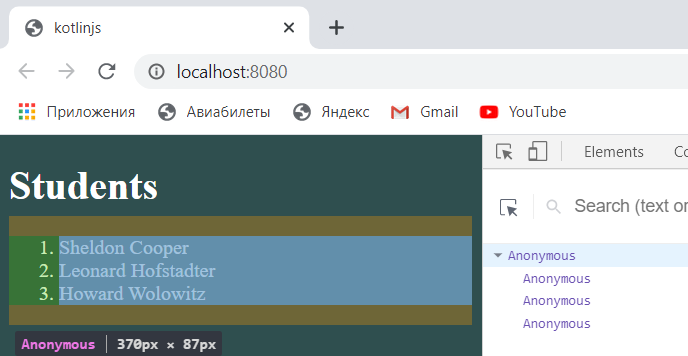
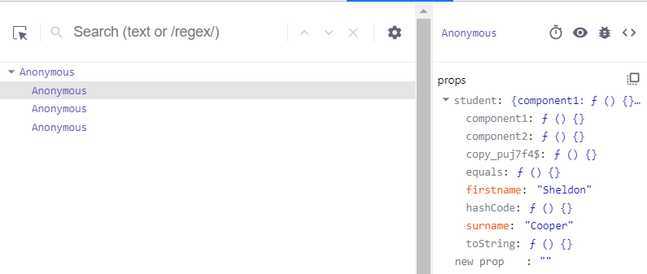
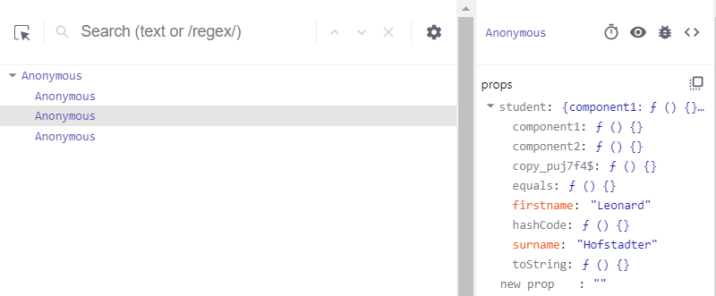
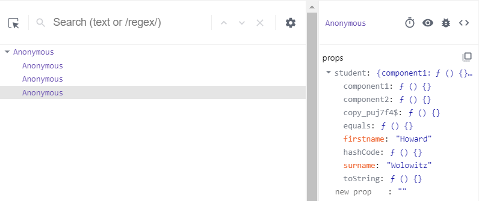

# lab4
Класс RListStudent: 
interface RListStudentProps : RProps { 
    var studentList: ArrayList<Student> 
} 

class RListStudent: RComponent<RListStudentProps, RState>() { 
    override fun RBuilder.render() { 
        ol { 
            studentList.forEach { 
                li { 
                    rstudent(it) 
                } 
            } 
        } 
    } 
} 

fun RBuilder.rliststudent(studentList: ArrayList<Student>) = 
    child( 
        functionalComponent<RListStudentProps> { 
            ol { 
                data.studentList.forEach { 
                    li { 
                        rstudent(it) 
                    } 
                } 
            } 
        } 
    ){ 
        attrs.studentList = studentList 
    } 
    В функцию передан список студентов.В child() вызвана функция для создания функционального компонента. Внутри этой функции находится rstudent, что позволяет создать компонент для каждого студента. В результате создается компонент, который содержит в себе список студентов. Список:  Элементы списка: студент 1 студент 2  студент 3 
